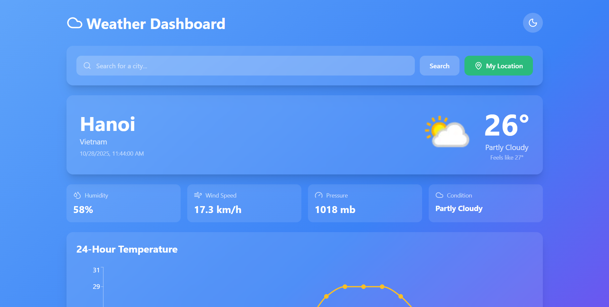
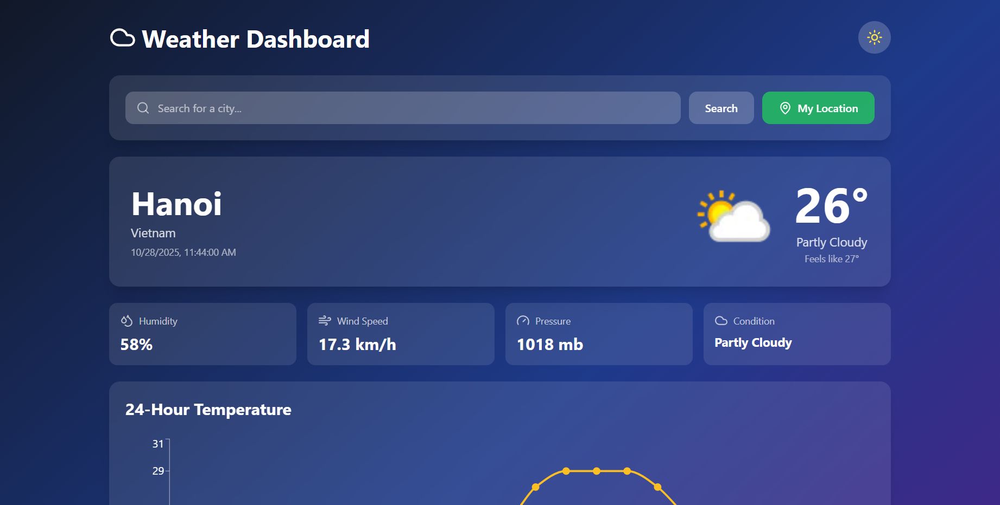
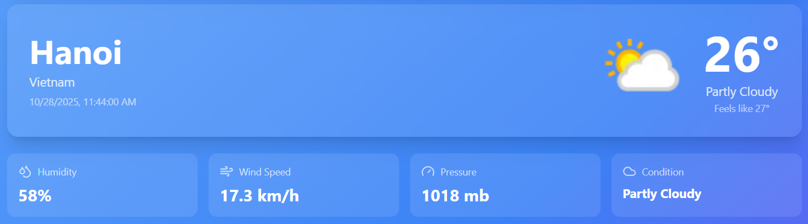
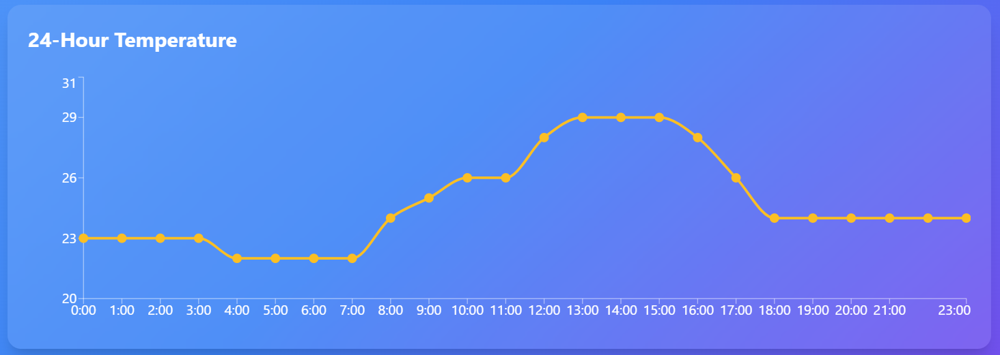
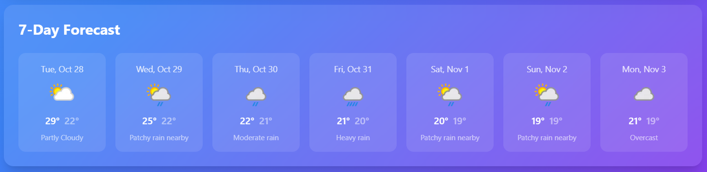
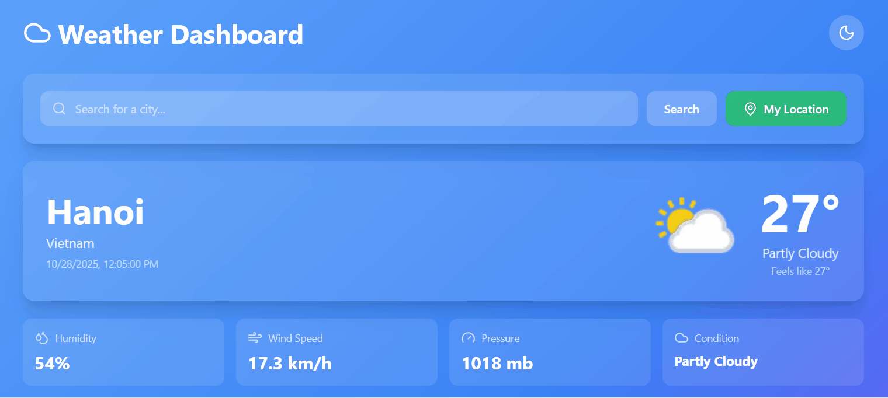
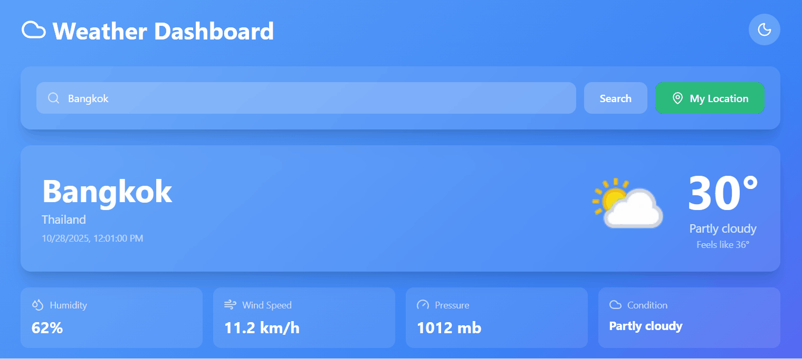

# 🌤️ Weather Dashboard

Ứng dụng theo dõi thời tiết hiện đại, đầy đủ tính năng được xây dựng bằng React, TypeScript và Tailwind CSS.

## ✨ Tính Năng

- 🔍 **Tìm kiếm thành phố** - Tra cứu thời tiết bất kỳ thành phố nào trên thế giới
- 📍 **Geolocation** - Tự động phát hiện vị trí hiện tại của bạn
- 🌡️ **Thời tiết hiện tại** - Nhiệt độ, cảm giác như, độ ẩm, tốc độ gió, áp suất
- 📊 **Biểu đồ 24 giờ** - Trực quan hóa nhiệt độ theo giờ với Recharts
- 📅 **Dự báo 7 ngày** - Xem trước thời tiết cả tuần
- 🌓 **Chế độ tối** - Chuyển đổi giữa light/dark mode
- 💾 **Nhớ thành phố** - Tự động load thành phố cuối cùng khi mở lại
- 📱 **Responsive hoàn toàn** - Hoạt động mượt mà trên mobile, tablet và desktop
- ✨ **Hiệu ứng đẹp mắt** - Gradient backgrounds và smooth transitions

## 🚀 Demo Trực Tuyến

👉 **[Xem Demo](https://weather-dashboard-blue-chi.vercel.app)**

## 🛠️ Công Nghệ Sử Dụng

- **React 19** - Thư viện UI
- **TypeScript** - Đảm bảo type safety
- **Tailwind CSS 3** - Framework CSS utility-first
- **Recharts** - Thư viện biểu đồ responsive
- **Axios** - HTTP client
- **Lucide React** - Bộ icon đẹp và nhẹ
- **WeatherAPI.com** - API dữ liệu thời tiết
- **Vite** - Build tool nhanh

## 💻 Bắt Đầu

### Yêu Cầu

- Node.js 18+
- npm hoặc yarn
- API key từ WeatherAPI.com (miễn phí)

### Cài Đặt

```bash
# Clone repository
git clone https://github.com/nbv9704/weather-dashboard.git
cd weather-dashboard

# Cài đặt dependencies
npm install

# Tạo file .env từ template
cp .env.example .env

# Mở .env và thêm API key của bạn
# VITE_WEATHER_API_KEY=your_api_key_here

# Chạy development server
npm run dev

# Build cho production
npm run build
```

### Lấy API Key

1. Truy cập [WeatherAPI.com](https://www.weatherapi.com/signup.aspx)
2. Đăng ký tài khoản miễn phí
3. Copy API key từ dashboard
4. Dán vào file `.env`

## 📸 Ảnh Chụp Màn Hình

### Light Mode


### Dark Mode


### Current Weather


### 24-Hour Temperature


### 7-Day Forecast


### City Search


### Current Location


## 🎯 Kiến Thức Đạt Được

### 1. API Integration

- Tích hợp RESTful API với Axios
- Xử lý async/await và error handling
- Environment variables với Vite
- Rate limiting và caching strategies

### 2. TypeScript Best Practices

- Strict typing với interfaces
- Generic custom hooks
- Type-safe API responses
- Union types và optional properties

### 3. React Patterns

- Custom hooks để tái sử dụng logic
- Component composition
- Props drilling management
- State management với useState và useEffect

### 4. Data Visualization

- Recharts integration
- Responsive charts
- Custom tooltips và styling
- Real-time data updates

### 5. User Experience

- Geolocation API
- LocalStorage persistence
- Dark mode implementation
- Loading states và error handling
- Responsive design với Tailwind

## 🌍 API Usage

Ứng dụng sử dụng **WeatherAPI.com** với các endpoint:

- **Forecast API** - Thời tiết hiện tại + 7 ngày
- **Search API** - Tìm kiếm thành phố
- **Free tier**: 1,000,000 calls/tháng

## 🔮 Tính Năng Tương Lai

- [ ] Lưu danh sách thành phố yêu thích
- [ ] So sánh thời tiết nhiều thành phố
- [ ] Weather alerts và notifications
- [ ] UV index và air quality
- [ ] Biểu đồ mưa và tuyết
- [ ] Hỗ trợ đa ngôn ngữ (Tiếng Việt)
- [ ] Widget cho desktop
- [ ] PWA support (offline mode)
- [ ] Share weather trên social media

## 👨‍💻 Tác Giả

**Ngô Bảo Việt**

- GitHub: [@nbv9704](https://github.com/nbv9704)
- Email: ngobaoviet97@gmail.com

## 📄 Giấy Phép

Dự án này là mã nguồn mở và có sẵn theo [Giấy phép MIT](LICENSE).

---

## 🌟 Đóng Góp

Mọi đóng góp đều được chào đón! Vui lòng tạo Pull Request hoặc mở Issue nếu bạn có ý tưởng cải thiện.
